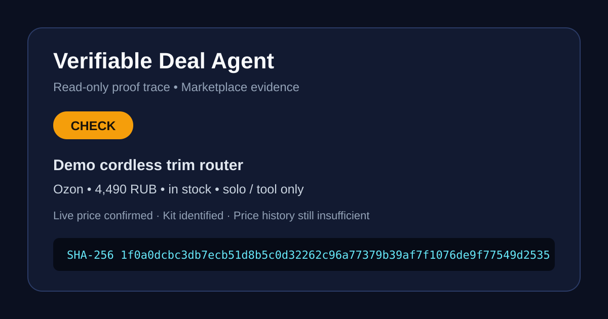

# Demo proof trace

The public fixture in [`examples/verified-check.evidence.json`](../examples/verified-check.evidence.json)
models a read-only `CHECK` decision for a live marketplace offer.



```powershell
npm run trace -- examples\verified-check.evidence.json out\verified-check.trace.json
Get-Content out\verified-check.trace.json
```

The resulting `sha256` covers the entire evidence payload: marketplace source,
URL, checked price, stock state, kit, decision and reasons. It does not cover
`createdAt`, so a trace can be regenerated and independently verified later.

This is a demonstration fixture only. It is not a purchasing recommendation and
does not represent a live offer.
